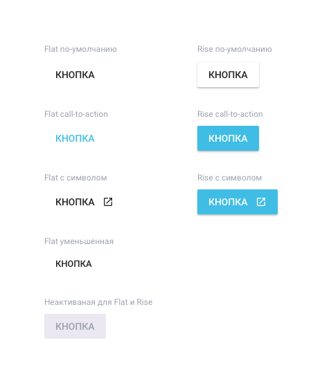
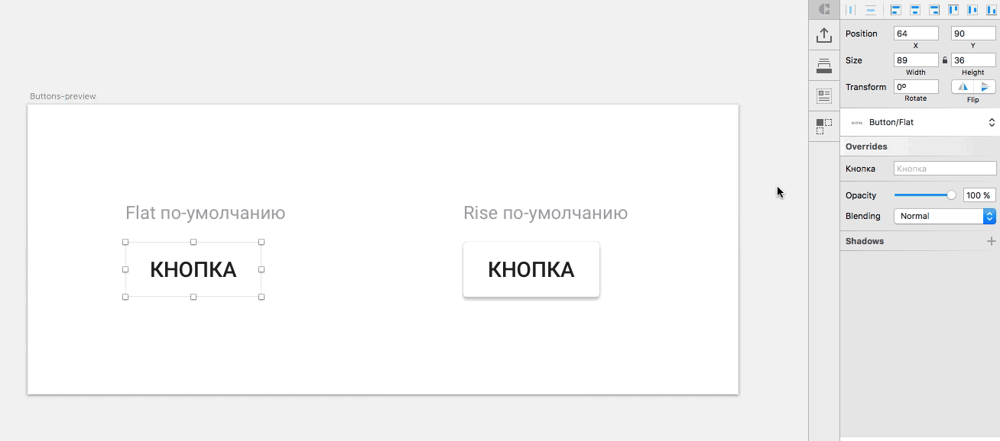
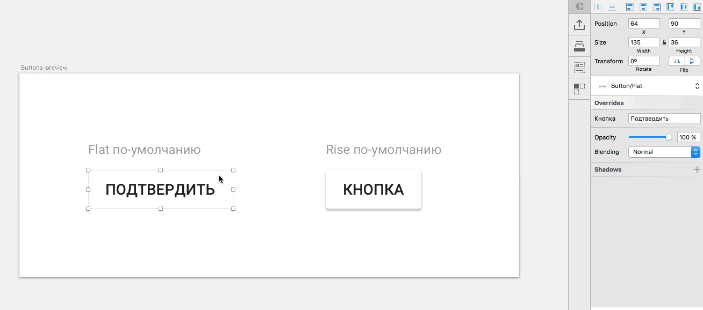
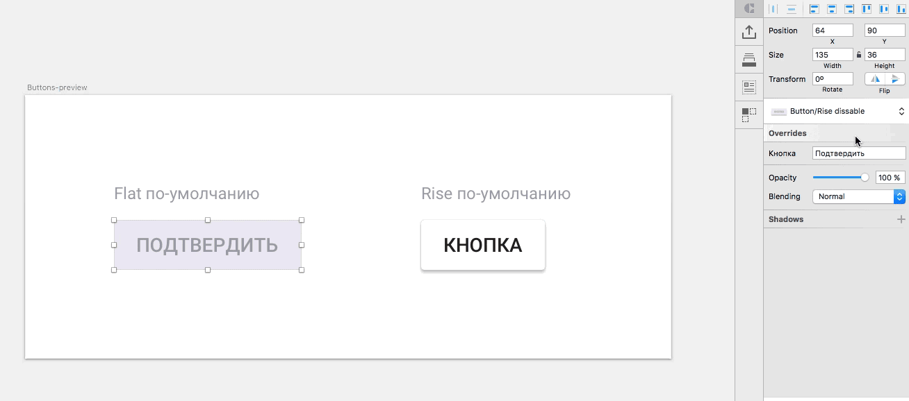
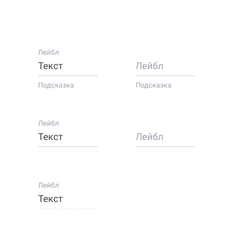

# UI material design in sketch-symbols for CRAFT

Symbols of buttons and text fields in materil design for CRAFT.

# Installation

+ Download the [zip file](https://github.com/nostrism/ui-material-in-symbols/archive/master.zip)
+ Unzip the zip file
+ Open Sketch file
+ Open Craft `⌘+P`
+ Choose library icon
+ Choose libtaty from folder ui-material-in-symbols-master `Material.Buttonsandfields.library`

# Features

### Buttons

You can write in any text in button. Customized sizes manually. But this can be done by eye, since all distances will still be correct.

You can choose any style for button: rise, flat or dissable, call-to-action or simple.

Even buttons with icon inside. Can be used any material icon.

### Text fields

