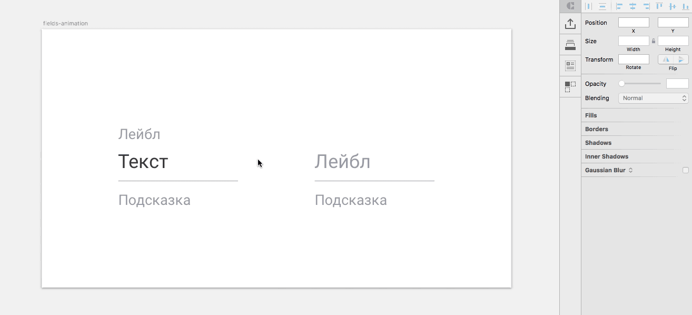
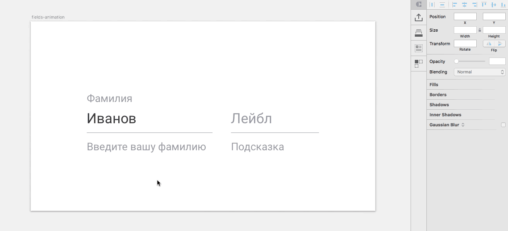
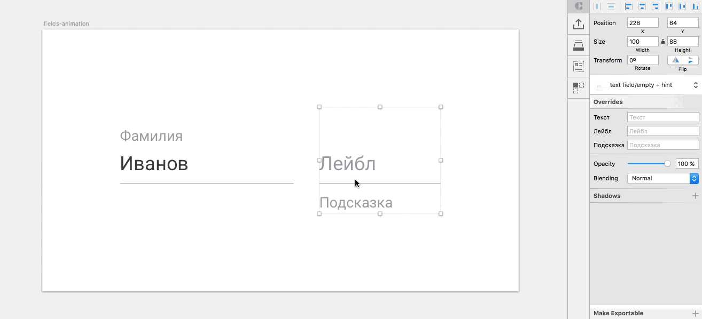

# Material design: UI components library in sketch-symbols for CRAFT

Symbols of buttons and text fields in material design for CRAFT.

# Installation

+ Download the [zip file](https://github.com/nostrism/ui-material-in-symbols/archive/master.zip)
+ Unzip it
+ Open Sketch file
+ Open CRAFT `⌘+P`
+ Choose library icon
+ Choose libraty from folder ui-material-in-symbols-master `Material.Buttonsandfields.library`

# Features

### Buttons

You can write in any text in button. Customized sizes manually. But this can be done by eye, since all distances will still be correct.

You can choose any style for button: rise, flat or dissable, call-to-action or simple.

Even buttons with icon inside. Can be used any material icon.

### Text fields

You can write in any text in fields: label, text and hint.

You can choose any style for field: default, empty or dissable, with hint or without.

Text always be on correct place — lable on lable, text on text. Every symbols have label, text and hint. Even changed style text will no be disappear.

